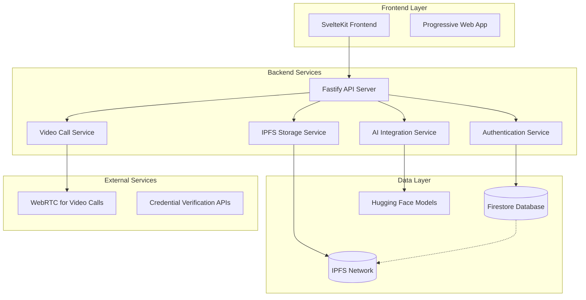

# Med Connect Web Application - Design Document

## Overview

Med Connect is a comprehensive medical platform that connects patients and doctors through multiple interaction channels including Q&A forums, AI-powered medical assistance, and video consultations. The platform leverages decentralized storage (IPFS) for user data, Firestore for metadata management, and implements a staged verification system for medical professionals.

## Architecture

### High-Level Architecture



### Technology Stack

**Frontend:**
- SvelteKit with TypeScript
- Tailwind CSS for styling
- WebRTC for video calls
- Progressive Web App capabilities

**Backend:**
- Fastify.js with Node.js
- Firebase/Firestore for metadata storage
- IPFS (Helia) for decentralized user data storage
- JWT for authentication
- Hugging Face Inference API for AI models

**Infrastructure:**
- Docker containerization
- Environment-based configuration
- CORS and security middleware

## Components and Interfaces

### 1. User Management System

#### User Data Architecture
- **IPFS Storage**: Complete user profiles stored as immutable content
- **Firestore Mapping**: Username → IPFS CID mapping for efficient retrieval
- **Role-Based Access**: Doctor vs Patient role differentiation

#### User Profile Structure
```typescript
interface UserProfile {
  username: string;
  role: 'doctor' | 'patient';
  email?: string;
  verified: boolean;
  createdAt: string;
  updatedAt: string;
  // Additional profile data stored in IPFS
  ipfsData?: {
    personalInfo: object;
    medicalHistory?: object; // For patients
    credentials?: object; // For doctors
  };
}
```

#### Firestore Schema
```typescript
// Collection: users
interface FirestoreUser {
  username: string; // Primary identifier
  ipfsCid: string; // Points to IPFS stored data
  role: 'doctor' | 'patient';
  verified: boolean;
  lastUpdated: Timestamp;
}
```

### 2. Q&A Forum System

#### Question Management
```typescript
interface Question {
  id: string;
  title: string;
  content: string;
  category: string;
  authorUsername: string;
  authorRole: 'doctor' | 'patient';
  upvotes: number;
  downvotes: number;
  createdAt: string;
  updatedAt: string;
  tags: string[];
}

interface Answer {
  id: string;
  questionId: string;
  content: string;
  authorUsername: string;
  authorRole: 'doctor' | 'patient';
  upvotes: number;
  downvotes: number;
  isAccepted: boolean;
  createdAt: string;
}

interface Comment {
  id: string;
  parentId: string; // questionId or answerId
  parentType: 'question' | 'answer';
  content: string;
  authorUsername: string;
  authorRole: 'doctor' | 'patient';
  taggedUsers: string[];
  createdAt: string;
}
```

#### Voting System
```typescript
interface Vote {
  id: string;
  targetId: string; // questionId or answerId
  targetType: 'question' | 'answer';
  voterUsername: string;
  voteType: 'upvote' | 'downvote';
  createdAt: string;
}
```

### 3. AI Integration System

#### Prompt Refinement Flow
```typescript
interface PromptRefinement {
  id: string;
  originalPrompt: string;
  refinedPrompt: string;
  userUsername: string;
  modelUsed: string;
  status: 'pending' | 'refined' | 'sent';
  createdAt: string;
}

interface AIResponse {
  id: string;
  promptId: string;
  response: string;
  model: string;
  confidence?: number;
  createdAt: string;
}
```

#### Hugging Face Integration
- **Primary Model**: `google/medgemma-4b-it`
- **Refinement Pipeline**: User prompt → Model refinement → User review → Final submission
- **Response Handling**: Structured medical responses with confidence scoring

### 4. Video Consultation System

#### Doctor Discovery
```typescript
interface DoctorAvailability {
  doctorUsername: string;
  isOnline: boolean;
  specialties: string[];
  currentLoad: number; // Number of active consultations
  lastSeen: string;
}

interface ConsultationRequest {
  id: string;
  patientUsername: string;
  doctorUsername: string;
  category: string;
  description: string;
  status: 'pending' | 'accepted' | 'rejected' | 'completed';
  scheduledAt?: string;
  createdAt: string;
}
```

#### WebRTC Implementation
- **Signaling Server**: Integrated with Fastify backend
- **STUN/TURN Servers**: For NAT traversal
- **Recording**: Optional session recording with consent
- **Quality Monitoring**: Connection quality metrics

### 5. Doctor Verification System

#### Credential Management
```typescript
interface DoctorCredential {
  id: string;
  doctorUsername: string;
  credentialType: string;
  documentUrl: string; // IPFS CID for uploaded documents
  verificationStatus: 'pending' | 'verified' | 'rejected';
  verifiedBy?: string; // AI service or manual reviewer
  verificationDate?: string;
  expiryDate?: string;
  createdAt: string;
}
```

#### Verification Pipeline
1. **Document Upload**: Credentials stored on IPFS
2. **AI Processing**: Automated document verification
3. **Manual Review**: Fallback for complex cases
4. **Status Update**: Update user verification status
5. **Route Protection**: Enable verified doctor privileges

### 6. Doctor Discussion Forum

#### Private Discussion System
```typescript
interface DoctorDiscussion {
  id: string;
  title: string;
  content: string;
  category: string;
  authorUsername: string;
  participantCount: number;
  createdAt: string;
  updatedAt: string;
  tags: string[];
  isPrivate: true; // Always true for doctor discussions
}

interface DoctorComment {
  id: string;
  discussionId: string;
  content: string;
  authorUsername: string;
  taggedDoctors: string[];
  createdAt: string;
}
```

## Data Models

### IPFS Data Structure
```typescript
// Stored on IPFS, referenced by CID in Firestore
interface IPFSUserData {
  profile: {
    username: string;
    personalInfo: {
      fullName?: string;
      dateOfBirth?: string;
      location?: string;
      bio?: string;
    };
    medicalInfo?: {
      allergies?: string[];
      medications?: string[];
      conditions?: string[];
      emergencyContact?: object;
    };
    professionalInfo?: {
      licenseNumber?: string;
      specialties?: string[];
      experience?: number;
      education?: object[];
      certifications?: object[];
    };
  };
  metadata: {
    version: string;
    createdAt: string;
    updatedAt: string;
  };
}
```

### Firestore Collections

#### Core Collections
- `users`: Username → IPFS CID mapping
- `questions`: Q&A forum questions
- `answers`: Responses to questions
- `comments`: Comments on questions/answers
- `votes`: Upvote/downvote tracking
- `consultations`: Video consultation requests
- `doctor_availability`: Real-time doctor status
- `credentials`: Doctor verification documents
- `doctor_discussions`: Private doctor forum
- `ai_interactions`: AI chat history
- `refresh_tokens`: Authentication tokens

#### Indexing Strategy
```javascript
// Firestore composite indexes
{
  collection: 'questions',
  fields: [
    { fieldPath: 'category', order: 'ASCENDING' },
    { fieldPath: 'upvotes', order: 'DESCENDING' },
    { fieldPath: 'createdAt', order: 'DESCENDING' }
  ]
}

{
  collection: 'users',
  fields: [
    { fieldPath: 'role', order: 'ASCENDING' },
    { fieldPath: 'verified', order: 'ASCENDING' }
  ]
}
```

## Error Handling

### Error Categories
1. **Authentication Errors**: Invalid tokens, expired sessions
2. **Authorization Errors**: Insufficient permissions, unverified doctors
3. **Data Validation Errors**: Invalid input formats, missing required fields
4. **IPFS Errors**: Network issues, content retrieval failures
5. **AI Service Errors**: Model unavailability, rate limiting
6. **WebRTC Errors**: Connection failures, media access issues

### Error Response Format
```typescript
interface ErrorResponse {
  error: string; // Error code
  message: string; // Human-readable message
  details?: object; // Additional error context
  timestamp: string;
  requestId: string;
}
```

### Retry Strategies
- **IPFS Operations**: Exponential backoff with 3 retries
- **AI Requests**: Circuit breaker pattern with fallback
- **Database Operations**: Immediate retry for transient failures
- **WebRTC**: Automatic reconnection with quality degradation

## Testing Strategy

### Unit Testing
- **Service Layer**: Business logic validation
- **Data Models**: Schema validation and transformations
- **Utility Functions**: Helper function correctness
- **Authentication**: Token generation and validation

### Integration Testing
- **API Endpoints**: Request/response validation
- **Database Operations**: CRUD operations with Firestore
- **IPFS Integration**: Content storage and retrieval
- **AI Service Integration**: Model interaction testing

### End-to-End Testing
- **User Registration Flow**: Complete signup process
- **Q&A Workflow**: Question posting, answering, voting
- **Video Consultation**: Doctor discovery and connection
- **Doctor Verification**: Credential upload and verification

### Performance Testing
- **Load Testing**: Concurrent user scenarios
- **IPFS Performance**: Large file upload/download
- **Database Queries**: Complex query optimization
- **WebRTC Scalability**: Multiple simultaneous calls

## Security Considerations

### Data Protection
- **IPFS Encryption**: Sensitive data encrypted before storage
- **JWT Security**: Short-lived access tokens with refresh mechanism
- **Input Validation**: Comprehensive sanitization and validation
- **Rate Limiting**: API endpoint protection against abuse

### Access Control
- **Role-Based Permissions**: Doctor vs Patient access levels
- **Verification Requirements**: Protected routes for verified doctors
- **Session Management**: Secure token handling and invalidation
- **CORS Configuration**: Restricted cross-origin access

### Privacy Compliance
- **Data Minimization**: Store only necessary information
- **User Consent**: Explicit consent for data processing
- **Right to Deletion**: IPFS content removal mechanisms
- **Audit Logging**: Track sensitive data access

## Deployment Architecture

### Development Environment
- **Local Development**: Docker Compose setup
- **Hot Reloading**: Frontend and backend development servers
- **Test Databases**: Isolated test data environments

### Production Environment
- **Container Orchestration**: Docker containers with health checks
- **Load Balancing**: Multiple backend instances
- **CDN Integration**: Static asset delivery
- **Monitoring**: Application performance and error tracking

### Scalability Considerations
- **Horizontal Scaling**: Stateless backend services
- **Database Sharding**: Firestore collection distribution
- **IPFS Clustering**: Distributed content storage
- **Caching Strategy**: Redis for frequently accessed data

## Migration Strategy

### Current State Analysis
The existing codebase has:
- ✅ Fastify backend with authentication
- ✅ SvelteKit frontend structure
- ✅ Firebase/Firestore integration
- ✅ IPFS plugin setup
- ✅ Basic routing structure
- ❌ Username-only authentication (needs update from first/last name)
- ❌ Q&A forum implementation
- ❌ AI integration
- ❌ Video consultation system
- ❌ Doctor verification system

### Implementation Phases
Following the staged approach defined in requirements:

**Stage 1**: Update authentication to username-only, implement IPFS user data storage
**Stage 2**: Build Q&A forum with voting and categorization
**Stage 3**: Integrate AI models with prompt refinement
**Stage 4**: Implement video consultation system
**Stage 5**: Build doctor verification system
**Stage 6**: Create private doctor discussion forum

Each stage builds upon the previous, ensuring incremental delivery and testing.